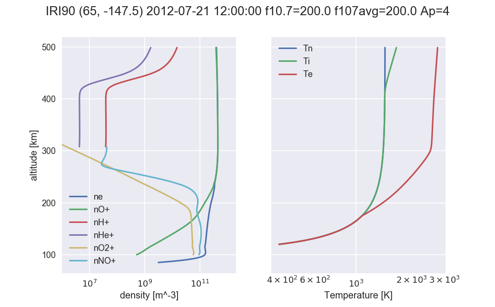

[](https://github.com/space-physics/iri90/actions)

[](https://pypi.python.org/pypi/iri90)
[](http://pepy.tech/project/iri90)


# IRI90: International reference ionosphere in Python

> IRI-90 provides **monthly mean values** for magnetically quiet
> conditions at non-auroral latitudes in the **altitude range 50km to
> 2000km**.

However, IRI90 is often used as an initialization for conditions at
auroral latitudes, understanding the caveats.



## Install

A Fortran compiler such as `gfortran` is needed.
We use `f2py` (part of `numpy`) to seamlessly use Fortran libraries from Python.
If you don't have one, here is how to install Gfortran:

* Linux: `apt install gfortran`
* Mac: `brew install gcc`
* [Windows](https://www.scivision.dev/windows-gcc-gfortran-cmake-make-install/) using Windows PowerShell:

   ```posh
   echo "[build]`ncompiler=mingw32" | Out-File -Encoding ASCII ~/pydistutils.cfg
   ```

Then

```sh
git clone https://github.com/space-physics/iri90

python -m pip install -e iri90
```


## Usage

This IRI90 Python module is as small and clean as possible to enable your custom IRI90 applications.

```python
import iri90

iono = iri90.runiri(dtime, altkm, latlon, f107, f107s, ap=p.ap)
```

`iono` is an xarray.DataArray indexable by species, altitude, etc. and includes metadata.

### Altitude profile

density and temperature:
```sh
python AltitudeProfile.py
```

## References

[Fortran Code](http://download.hao.ucar.edu/pub/stans/iri/iri90.f)
